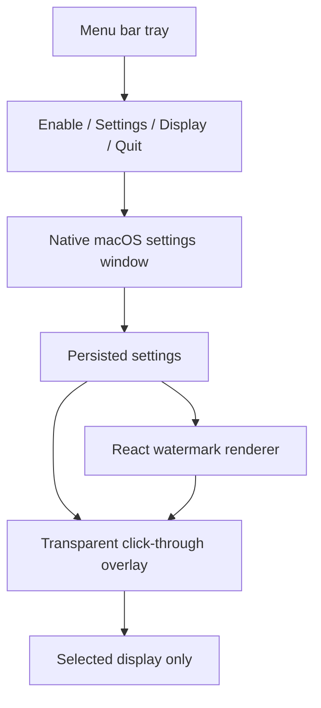
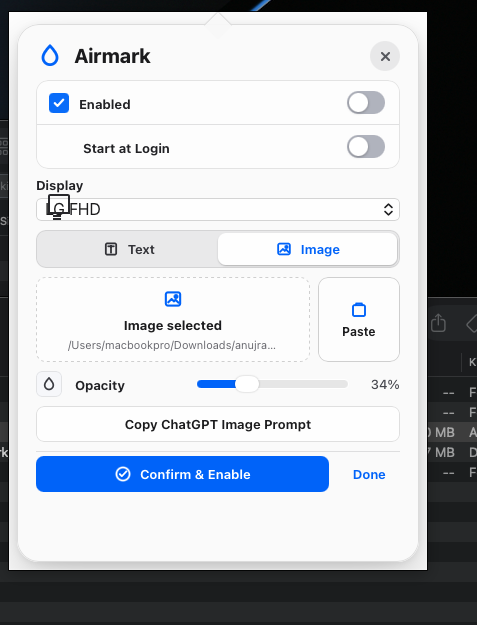
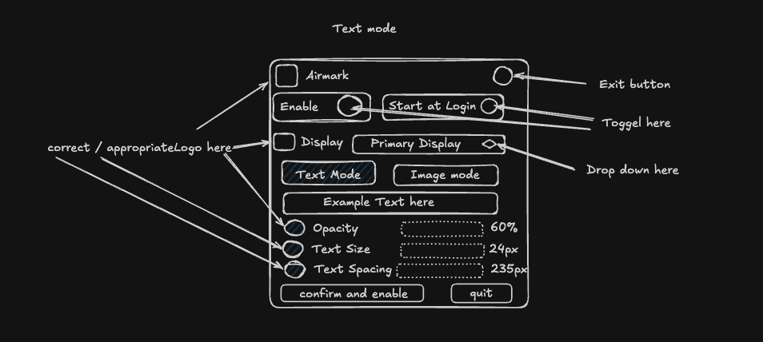
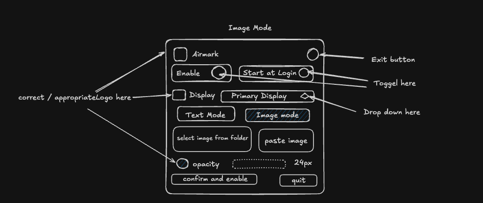

# Airmark

Airmark is a macOS 13+ menu-bar app that puts a watermark on one selected display without blocking the keyboard, mouse, or menu bar.

<p>
  <a href="https://github.com/anujraja404/airmark/releases/latest">
    <strong>Download the latest DMG</strong>
  </a>
</p>

## How It Works



## Features

- Dockless macOS utility.
- Tray menu for enable/disable, settings, display selection, and quit.
- Text mode with opacity, size, and spacing controls.
- Image mode with drag/drop, file picker, and clipboard paste.
- Settings persist across relaunches.
- Launch-at-login support.

## Screenshots





## Install

1. Open the DMG.
2. Drag `Airmark.app` into `Applications`.
3. Launch Airmark from `Applications` or the menu bar.

## Develop

```bash
npm install
npm run tauri dev
```

## Build

```bash
npm run tauri build
```

Release artifacts:

- `src-tauri/target/release/bundle/macos/Airmark.app`
- `src-tauri/target/release/bundle/dmg/Airmark_0.1.0_aarch64.dmg`
